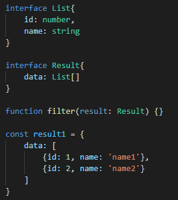
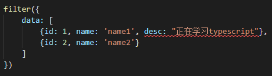
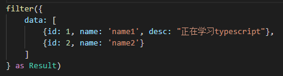
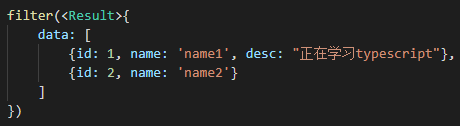
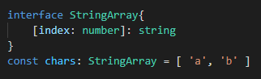
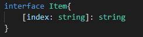
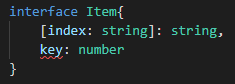
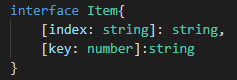
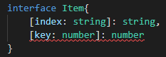
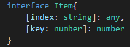

# Typescript study

### 学在最前

任何能用javascript实现的应用最终都会用javascript实现。

在实际项目中当我们调用别人写的一个函数时，那个函数又没有留下任何注销，这个时候我们要搞清楚这个函数的调用参数的意义，就需要深入那个函数内部进行查看了。

有时候我们维护一个公众函数，你殚精竭虑地优化了一个参数类型，但不知道有多少处引用，是不是很担心，你的修改会出现其他功能错误呢。

以上种种是因为javascript是一门动态弱类型语言。对变量的类型非常宽容,而且不会在这些变量和它们的调用者之间建立结构化的契约。如果你长期在没有类型约束的环境下开发，就会造成“类型思维”的缺失，养成不良的编程习惯，这也是做前端开发的短板之一。值得庆幸的是开源社区一直在努力解决这个问题，早在2014年Facebook就推出了Flow，微软在同年也发布了Typescript的1.0版本。它们都致力于为Javascript提供静态类型检查，现在多年过去了，显然Typescript发展得更好一些。

#### 什么是Typescript？

根据官方的定义Typescript是拥有类型系统的Javascript的超集，可以编译成纯Javascript。这里你需要注意三个要点：

1. 类型检查 

   Typescript会在编译代码时进行严格的静态类型检查，这意味着你可以在编码的阶段，发现可能存在的隐患。

2. 语言扩展

   Typescript会包括来自ECMASript 6 和未来提案中的特性，比如异步操作和装饰器，也会从其他语言借鉴某些特性，比如接口和抽象类。

3. 工具属性

   Typescript可以编译成标准的Javascript，可以在任何浏览器、操作系统上运行，无需任何运行时的额外开销，从这个角度上讲Typescript更像是一个工具，而不是一门独立的语言。

   
#### 为什么要使用Typescript ?

   使用Typescript能带来其他的好处，比如Visual Studio Code具有强大的自动补全、导航和重构功能，这使得接口定义可以直接代替文档，同时也可以提高开发效率，降低维护成本，更重要的是Typescript可以帮助团队重塑“类型思维”。接口提供方被迫去思考API的边界。他们将从代码的编写者蜕变成为代码的设计者。

####  什么是强类型语言

在强类型语言中，当一个对象从调用函数传递到被调用函数时，其类型必须与被调用函数中声明的类型兼容 — Liskove,Zilles 1974

```javascript
function Test1() {
    Test2(a)
}
function Test2(b) {
    // b 可以被赋值 a,程序运行良好
}
```

- 强类型语言：不允许改变变量的数据类型，除非进行强制类型转换。

- 弱类型语言：变量可以被赋予不同的数据类型

  

静态类型语言：在编译阶段确定所有变量的类型

- 编译阶段确定属性偏移量
- 用偏移量访问代替属性名访问
- 偏移量信息共享


- 对类型极度严格
- 立即发现错误
- 运行时性能好
- 自文档化

动态类型语言：在执行阶段确定所有变量的类型

- 在程序运行时，动态计算属性偏移量
- 需要额外的空间存储属性名
- 所有对象的偏移信息各存一份


- 对类型非常宽松
- Bug可能隐藏数月甚至数年
- 运行时性能差
- 可读性差

#### TS 编译的编译原理

问：TypeScript 可以被翻译为 JS，但这并不意味着 TS 是编译型语言对吧？那为什么用编译这个词呢？为什么不选择翻译，这样的词汇；TS 编译大概是怎样编译的呢？ 

答：翻译是一种简单的映射，而编译则包含复杂的转换过程，含义更加确切。广义的编译是指把源语言转换成目标语言的过程，比如 TypeScript 编译器会先扫描源代码，把它转换抽象语法树，然后再转换成 JavaScript；狭义的编译是指把源语言转换成机器码，需要这种转换的语言通常称为编译型语言（比如C++），而 TypeScript 的产物 JavaScript 则是解释型语言。 

### 环境配置

```
npm init -y
```

```
npm i typescript -g
```

全局安装好之后我们就可以使用ts编译器了--tsc

```
// 初始化生成tsconfig.json文件
tsc --init
// 编译文件
tsc ./src/index.ts
```

配置构建工具

```
npm i webpack webpack-cli webpack-dev-server -D
```

为了工程的可维护性，我们可以把开发环境的配置、生产环境的配置、公共的配置分开书写，最后通过插件来合并。

既然我们引入了ts文件，我们就需要安装ts的loader进行编译打包,注意我们需要在本地安装typescript

```
npm i ts-loader typescript -D
```

我们用到了HtmlWebpackPlugin，它的作用是通过一个模版帮助我们生成网站的首页，而且可以帮我们把输出文件自动嵌入到这个文件中。

```
npm i html-webpack-plugin -D
```

在开发环境中我们开启了sourcemap

```javascript
module.exports = {
    devtool: 'eval-cheap-module-source-map' // webpack5
}
```

生产环境我们使用到了CleanWebpackPlugin 插件

```
npm i clean-webpack-plugin -D
```

合并配置文件我们使用到了webpack-merge

```
npm i webpack-merge -D
```

更改package.json的文件入口

```javascript
"main": "./src/index.ts"
```

编写启动开发环境命令

```javascript
"scripts": {
   "start": "webpack serve --mode development --env development --config ./build/webpack.config.js",
   "build": "webpack --mode production --env production --config ./build/webpack.config.js"
   "test": "echo \"Error: no test specified\" && exit 1"
}
```

### never与void

在js中void是一个操作符，它可以让任何表达式返回undefined, undefined不是一个保留字

```javascript
// 可以对undefined进行声明赋值
(function() { 
    const undefined = 0; 
    console.log(undefined)
})()
```

使用void 0 则可以确保我们的返回值为undefined

```javascript
// never
let error = () => {
    throw new Error('error')
}
```

一个函数如果抛出了一个错误，则它永远不会有返回值，则返回值类型为never

### 对象类型接口

 

实际过程中，可能后端返回的数组会增加一些数据 

 

我们发现ts并没有报错，这是因为ts采取了一种鸭式变形法，这是一种动态语言风格。一个比较形象的说法是，一只鸟看起来像鸭子，走起来像鸭子，叫起来像鸭子，那么这只鸟就可以被认为是一只鸟。回到ts中，我们只要传入的对象满足接口的必要条件，那么就是被允许的，即使传入多余的字段也可以通过类型检查。

但是如果我们传入对象字面量的话，ts就会对额外的字段进行检查 

 

如果我们使用对象字面量进行传值的话，就要使用断言，类型断言的意思是我们要明确告诉编译器，这个对象字面量的类型就是Result，这样编译器就绕过类型检查 

 

类型断言还可以这样写

 

但建议使用第一种，因为下面这种在React中可以产生歧义。

### 索引签名

我们还可以使用**索引签名**

 

这是一个字符串索引签名，它的含义是使用任意字符串去索引List可以得到任意的结果。这样List就可以支持多个属性了。

#### 数字索引

 

含义就是用任意数字去索引StringArray得到的结构都是字符串

#### 字符串索引

 

含义就是用任意字符串去索引Item得到的结果都是字符串

这样声明之后，我们就不能再声明一个number类型的成员了

 

因为两种签名是可以混用的，比如还可以在Item中增加一个数字索引签名

 

这样就既可以用数字去索引Item又可以用字符串索引Item，但这里需要注意的是，数字索引签名的返回值一定要是字符串索引签名返回值的子类型，这是因为javascript会进行类型转换，将number转换成string，这样就能保持类型的兼容性。

比如说我们把数字索引签名的返回值改成number，那么这样就和string不兼容了。

 

所以要取一个可以兼容到number的类型，比如any。

 

### 函数类型接口

通过Function来定义 

```javascript
function fn1(x: number, y: number) {
    return x + y
}
```

通过一个变量来定义 

```javascript
let fn2: (x: number, y: number) => number
```

通过类型别名来定义 

```javascript
type fn3 = (x: number, y: number) => number
```

通过接口来定义 

```javascript
interface fn4 {
    (x: number, y: number): number
}
```

### 混合类型接口

定义接口

```javascript
interface lib {
    (): void // 表示这个类是个函数，返回值是void
    version: string, // 属性
    toDo(): void // 方法
}
```

实现

```javascript
let lib: lib = (() => {}) as lib
lib.version = '1.0'
lib.toDo = () => {}
```

创建多个实例 

```javascript
function getLib() {
    let lib: lib = (() => {}) as lib
    lib.version = '1.0'
    lib.toDo = () => {} 
    return lib
}
let lib1 = getLib()
lib1.version
lib1.toDo()
let lib2 = getLib()
lib2.version
lib2.toDo()
```

### 函数重载

```javascript
class A {
  sum(a: number, b: number) {
    return a + b;
  }
}

class B extends A {
  sub(a: number, b: number) {
    return a - b;
  }
}

function maker(): B;
function maker(p: string): A;
function maker(p?: string) {
  if (p) {
    return new A();
  }
  return new B();
}

const instane = maker();
instane.sub(1, 2);

const instane2 = maker("ss");
instane2.sum(1, 2);
```

ts编译器在处理重载的时候，会去查询一个重载的列表，并且会尝试匹配第一个定义，如果不匹配就继续往下查找，所以我们要把最容易匹配的放在第一个。

#### 断言

```javascript
type NumGenerator1 = () => number;

function myFunc1(numGenerator1: NumGenerator1 | undefined) {
  const num1 = numGenerator1!(); 
  const num2 = numGenerator1!(); 
}
```

使用断言使编译器通过检查，不过不推荐这种写法，而应该使用重载 

#### 重载

```javascript
type NumGenerator2 = () => number;
function myFunc2(): undefined;
function myFunc2(numGenerator2?: NumGenerator2) {
  if (numGenerator2) {
    const num1 = numGenerator2();
    const num2 = numGenerator2();
  }
}
```

#### 可选项

```javascript
type NumGenerator3 = () => number;
function myFunc3(numGenerator3: NumGenerator3 | undefined) {
  const num1 = numGenerator3?.();
}
```

### 类

总体来说ts的类覆盖了js的类，同时引入了其他的一些新特性

```javascript
class Cat{
    constructor(name:string) {
        // this.name = name
    }
    name?: string
    run() {}
}
```

无论在ts中还是es中，类成员的属性，都是实例属性，而不是原型属性，类成员的方法，都是实例方法。

#### 继承

```javascript
class ChildCat extends Cat {
    constructor(name: string, public color: string) {
        super(name)
    }
}
```

构造函数中一定要调用super

#### 修饰符

public默认都是public，含义就是对所有人都是可见的

private私有成员，只能在类的本身调用，不能被实例调用，也不能被子类调用

protected受保护成员，只能在类或者子类中访问，而不能在类的实例中访问

constructor也可以添加protected，表明这个类不能实例化，只能被继承

readonly 一定要初始化，跟实例属性是一样

除了类成员可以添加修饰符之外，构造函数的参数也可以添加修饰符，它的作用就是将参数自动变成实例的属性，这样就省略在类中的定义了。

```javascript
class ChildCat extends Cat {
    constructor(name: string, public color: string) {
        super(name)
    }
}
```

static，类的静态修饰符，静态成员也可以被继承

#### 抽象类

es中并没有抽象类，这是ts对类的拓展，所谓抽象类，就是只能被继承而不能实例化的类。在抽象类中可以定义一个方法，它可以有具体的实现，这样子类就不用实现了，就实现了方法的复用。在抽象类中也可以不指定具体的方法实现，这就构成了抽象方法。抽象方法的好处就是你明知道子类中有其他的实现，那就没必要在父类中实现了。

```javascript
abstract class Animal {
    eat() {
        console.log('eat')
    }
    abstract sleep(): void
}
class Chicken extends Animal {
    sleep() {
        console.log('sleep')
    }
}
const chicken = new Chicken()
chicken.eat()
```

#### 多态

所谓多态就是在父类中定义一个抽象方法，在多个子类中对方法有不同的实现，在程序运行的时候，会根据不同的对象，执行不同的操作，实现了运行时的绑定 

```javascript
class Cattle extends Animal {
    sleep() {
        console.log('Cattle sleep')
    }
}
const cattle = new Cattle()
const animals: Animal[] = [chicken, cattle]
animals.forEach(o => {
    o.sleep()
})
```

#### 链式调用

链式调用的核心就在于调用完的方法讲自身的实例返回

```javascript
class WorkFlow {
    step1() {
        return this
    }
    step2() {
        return this
    }
}
new WorkFlow().step1().step2()

class Myflow extends WorkFlow {
    next() {
        return this
    }
}
new Myflow().next().step1().next().step2()
```

### 类型与接口的关系 

一个接口可以约束一个类成员有哪些属性以及他们的类型 

```javascript
interface Human {
    name: string;
    eat(): void
}
```

类实现接口的时候必须实现接口中声明的所有属性和方法 

```javascript
class Asian implements Human {
    constructor(name: string) {
        this.name = name
    }
    name: string
    eat() {}
}
```

接口只能约束类的公有成员 

#### 接口的继承 

接口可以像类一样相互继承，并且一个接口可以继承多个接口 

```javascript
interface Man extends Human {
    run(): void
}
interface Child {
    cry(): void
}
interface Boy extends Man,Child {}

const boy: Boy = {
    name: '',
    run() {},
    eat() {},
    cry() {}
}
```

从接口的继承可以看出，接口的继承可以抽离出可重用的接口，也可以将多个接口合并成一个接口 

#### 接口继承类 

接口除了可以继承接口之外，还可以继承类，这就相当于接口把类的成员都抽象出来，也就是只有类的成员结构，而没有具体的实现 

```javascript
class Auto {
    state = 1
}
interface AutoInterface extends Auto {

}
```

这样AutoInterface接口就隐含了state属性，要想实现这个AutoInterface接口只要一个类的成员和state的属性就可以了

```javascript
class C implements AutoInterface {
    state = 1
}
class Bus extends Auto implements AutoInterface {

}
```

在这个例子中我们就不必实现state属性了，因为Bus是Auto的子类自然继承了state属性 。这里需要额外注意的是，接口在抽离类的成员的时候，不仅抽离了公共成员，而且抽离了私有成员和受保护成员。 